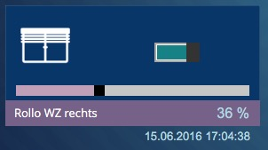

# ioBroker.homepilot

## Beschreibung
Dieser Adapter verbindet ioBroker mit der Rademacher Homepilot Basistation 9496 (1/2) über TCP/IP, um Rademacher DuoFern Geräte zu steuern. DuoFern sendet übrigens auf 434,5 MHz. Die als Standard eingestellte Dauer bis zur Synchronisierung der Homepilot Daten nach ioBroker beträgt 12s. In die andere Richtung werden Befehle zeitnah ausgeführt. Daher eignet sich der Adapter nicht zur Auswertung von Homepilot Sensoren, sondern eher zur Ansteuerung der Homepilot Aktoren aus ioBroker heraus (z.B. Homematic Wandtaster steuert Homepilot Rollladen-Aktor).

### Unterstütze Geräte

| Code | Produktname                 | Notiz                                  |  Datenpunkt  | Produkt Nr             |
|:----:|:---------------------------:|:--------------------------------------:|:------------:|:----------------------:|
| 40   | RolloTron Standard          | Gurtwickler                            |  level       |                        |
| 41   | RolloTron Comfort           | Gurtwickler                            |  level       |                        |
| 42   | Rohrmotor-Aktor             |                                        |  level       | [9471-1](https://www.rademacher.de/fileadmin/rad-daten/pdf/2_VBD_621-1-_09.14_-D_DuoFern_Rohrmotor-Aktor_Druckfreigabe.pdf)                 |
| 43   | Schaltaktor 2-Kanal         |  Universalaktor                        |  state       | 9470-2                 |
| 46   | Schaltaktor 1-Kanal         |  Steckdosenaktor                       |  state       | 9470-1                 |
| 47   | Rohrmotor-Steuerung         |  Rohrmotor Steuerung                   |  level       |                        |
| 48   | Dimmer                      |  Dimmaktor                             |  level       |                        |
| 49   | Rohrmotor                   |                                        |  level       |                        |
|  4   | Z-WAVE                      | Heizkörperstellantrieb                 |  temperature |                        |

Der Schaltaktor mit dem Duofern Code 43 bietet sowohl einen Licht- als auch einen Gerätemodus an. Je nach Einstellung liefert der Datenpunkt "AUF" ein "EIN" (Gerätemodus) oder ein "AUS" (Lichtmodus). Der Datenpunkt "AB" verhält sich umgekehrt.

#### Noch nicht unterstützt (Dank an [mhop](https://github.com/mhop/fhem-mirror/blob/master/fhem/FHEM/30_DUOFERN.pm))

| Code | Produktname                 | Notiz                                  |  Datenpunkt  | Produkt Nr             |
|:----:|:---------------------------:|:--------------------------------------:|:------------:|:----------------------:|
| 4B   | Connect-Aktor               |                                        |              |                        |
| 4C   | Troll Basis                 |                                        |              |                        |
| 4E   | SX5                         |                                        |              |                        |
| 61   | RolloTron Comfort Master    |                                        |              |                        |
| 62   | SupeFake Device             |                                        |              |                        |
| 65   | Bewegungsmelder             |                                        |              |                        |
| 69   | Umweltsensor                |                                        |              |                        |
| 70   | Troll Comfort DuoFern       |                                        |              |                        |
| 71   | Troll Comfort DuoFern<br/>(Lichtmodus)|                                        |              |                        |      | (Lichtmodus)                |                                        |              |                        |
| 73   | Raumthermostat              |                                        |              |                        |
| 74   | Wandtaster 6fach 230V       |                                        |              |                        |
| A0   | Handsender<br/>(6 Gruppen-48 Geraete)|                                        |              |                        |      | (6 Gruppen-48 Geraete)      |                                        |              |                        |
| A1   | Handsender<br/>(1 Gruppe-48 Geraete) |                                        |              |                        |      | (1 Gruppe-48 Geraete)       |                                        |              |                        |
| A2   | Handsender<br/>(6 Gruppen-1 Geraet) |                                        |              |                        |      | (6 Gruppen-1 Geraet)        |                                        |              |                        |
| A3   | Handsender<br/>(1 Gruppe-1 Geraet) |                                        |              |                        |      | (1 Gruppe-1 Geraet)         |                                        |              |                        |
| A4   | Wandtaster                  |                                        |              |                        |
| A5   | Sonnensensor                |                                        |              |                        |
| A7   | Funksender UP               |                                        |              |                        |
| A8   | HomeTimer                   |                                        |              |                        |
| AA   | Markisenwaechter            |                                        |              |                        |
| AB   | Rauchmelder                 |                                        |              |                        |
| AD   | Wandtaster 6fach Bat        |                                        |              |                        |


## Einstellungen
### IP und Port
Die IP Adresse der Homepilot Basisstation im lokalen Netzwerk. Ohne Eingabe verwendet der Adapter __homepilot.local__. Die Portnummer ist optional und wird nur bei Eingabe einer IP-Adresse berücksichtigt.

### Synchronisation
Dauer zwischen den Abfragen der Homepilot Basistation durch ioBroker. Die Eingabe ist optional. Standard ist 12s.

##  Datenpunkte
Es gibt zwei Hauptkanäle, einen für die Basisstation und einen für die gefundenen Gerätetypen:


homepilot.0.__station__ (data on Homepilot station)

homepilot.0.__devices.product__ (devices sort by product type)

Innerhalb des Kanals *devices.product* gibt es für jedes Gerät einen weiteren Kanal *deviceID*, beispielsweise. homepilot.0.devices.rollotron.__10001__.balkon

homepilot.0.devices.product.*deviceID*.__name__ (Zeichenkette)

homepilot.0.devices.product.*deviceID*.__description__ (Zeichenkette)

homepilot.0.devices.product.*deviceID*.__productName__ (Zeichenkette)

homepilot.0.devices.product.*deviceID*.__duofernCode__ (Zeichenkette)

homepilot.0.devices.product.*deviceID*.__hasErrors__ (Zahl)

homepilot.0.devices.product.*deviceID*.__status_changed__ (Zahl, Zeitstempel)

homepilot.0.devices.product.*deviceID*.__cid__ (Zeichenkette, beschreibbar)

homepilot.0.devices.product.*deviceID*.__level__ (Zahl)

homepilot.0.devices.product.*deviceID*.__level_inverted__ (Zahl)

homepilot.0.devices.product.*deviceID*.__temperature__ (Zahl, alternative)

homepilot.0.devices.product.*deviceID*.__state__ (boolean, Nur bei Schaltern)

homepilot.0.devices.__json__  (*JSON* Datei *json* Datenpunkt mit JSON Rückgabe )

homepilot.0.station.__ip__ (Zeichenkette)

homepilot.0.station.__UNREACH__ (boolean) (wahr, wenn Homepilot Basisstation nicht erreichbar ist)


Die Datenpunkte *cid*, *level* und ggf. *state*  können beschrieben werden. Sie werden auf Änderung aus anderen Adaptern (VIS, Javascript, Scenes) überwacht.

### Steuerung
#### level und level_inverted
Um die Rollläden aus Javascript, VIS oder z.B. Scenes zu steuern, gibt es zwei Möglichkeiten. 
Z.B. kann man den Rolladen mit der DeviceID 10002 (zB "Wohnzimmer rechts") steuern, indem der Datenpunkt 
homepilot.0.devices.product.*10002*.__level__ auf "30" gesetzt wird. __level__ ist eine ganze Zahl von 0 bis 100, andere Zahlen/Zeichen werden nicht angenommen.
Für ein Darstellung wie beim "Homematic"-System (0% = dunkel/unten, 100% = hell/oben), verwendet man den Datenpunkt __level_inverted__.

#### Command ID
Alternativ können auch die Command ID von Homepilot verwendet werden. Dazu wird einfach der passende Befehl in den Datenpunkt homepilot.0.devices.product.*deviceID*.__cid__  geschrieben.
Weiterhin gibt es den Datenpunkt *state* zur Steuerung / Anzeige von Schaltaktoren (wird nur angelegt, wenn Seriennummern 43 oder 46, Produktname "Universal-Aktor" bzw. "Steckdosenaktor"). Er wird am besten von einem VIS ctrl state Widget mit *true*/*false* beschrieben. Bei der Steuerung wird *true* in einen level-Wert von 100 übersetzt, *false* wird zu 0.
Diese Befehle sind bisher möglich zur Steuerung über cid in homepilot.0.devices.product.*deviceID*.__cid__

| CID | Befehle                          |
| :--:|:---------------------------------|
| 1   | UP, up, HOCH, hoch, RAUF, rauf   |
| 2   | STOP, stop, Stop                 |
| 3   | DOWN, down, RUNTER, runter       |
| 4   | POSITION_0, position_0, 0%       |
| 5   | POSITION_25, position_25, 25%    |
| 6   | POSITION_50, position_50, 50%    |
| 7   | POSITION_75, position_75, 75%    |
| 8   | POSITION_100, position_100, 100% |
| 9   | *POSITION_N (not yet)*           |
| 10  | EIN, ein, AN, an, ON, on         |
| 11  | AUS, aus, OFF, off               |
| 23  | INCREMENT, increment, +          |
| 24  | DECREMENT, decrement, -          |

## VIS Widgets
### Beispiel Rollläden
```
[{"tpl":"tplValueFloat","data":{"oid":"homepilot.0.devices.RolloTronStandard.10002.level","visibility-cond":"==","visibility-val":1,"is_comma":true,"is_tdp":"false","factor":"1","gestures-offsetX":0,"gestures-offsetY":0,"signals-cond-0":"==","signals-val-0":true,"signals-icon-0":"/vis/signals/lowbattery.png","signals-icon-size-0":0,"signals-blink-0":false,"signals-horz-0":0,"signals-vert-0":0,"signals-hide-edit-0":false,"signals-cond-1":"==","signals-val-1":true,"signals-icon-1":"/vis/signals/lowbattery.png","signals-icon-size-1":0,"signals-blink-1":false,"signals-horz-1":0,"signals-vert-1":0,"signals-hide-edit-1":false,"signals-cond-2":"==","signals-val-2":true,"signals-icon-2":"/vis/signals/lowbattery.png","signals-icon-size-2":0,"signals-blink-2":false,"signals-horz-2":0,"signals-vert-2":0,"signals-hide-edit-2":false,"digits":"0","html_append_singular":" %","html_append_plural":" %","name":"RolloTron Percent","label":"{homepilot.0.devices.RolloTronStandard.10002.name}"},"style":{"left":"519px","top":"555px","color":"lightblue","text-align":"right","z-index":"20"},"widgetSet":"basic"},{"tpl":"tplValueLastchange","data":{"oid":"homepilot.0.devices.RolloTronStandard.10002.status_changed","visibility-cond":"==","visibility-val":1,"gestures-offsetX":0,"gestures-offsetY":0,"signals-cond-0":"==","signals-val-0":true,"signals-icon-0":"/vis/signals/lowbattery.png","signals-icon-size-0":0,"signals-blink-0":false,"signals-horz-0":0,"signals-vert-0":0,"signals-hide-edit-0":false,"signals-cond-1":"==","signals-val-1":true,"signals-icon-1":"/vis/signals/lowbattery.png","signals-icon-size-1":0,"signals-blink-1":false,"signals-horz-1":0,"signals-vert-1":0,"signals-hide-edit-1":false,"signals-cond-2":"==","signals-val-2":true,"signals-icon-2":"/vis/signals/lowbattery.png","signals-icon-size-2":0,"signals-blink-2":false,"signals-horz-2":0,"signals-vert-2":0,"signals-hide-edit-2":false,"format_date":"DD.MM.YYYY hh:mm:ss"},"style":{"left":"432px","top":"582px","z-index":"20","color":"lightblue","width":"148px","height":"15px","font-size":"80%","text-align":"right"},"widgetSet":"basic"},{"tpl":"tplMetroTileShutter","data":{"oid":"homepilot.0.devices.RolloTronStandard.10002.level","visibility-cond":"==","visibility-val":1,"step":"-1","bg_class":"bg-darkCobalt","brand_bg_class":"bg-mauve","gestures-offsetX":0,"gestures-offsetY":0,"signals-cond-0":"==","signals-val-0":true,"signals-icon-0":"/vis/signals/lowbattery.png","signals-icon-size-0":0,"signals-blink-0":false,"signals-horz-0":0,"signals-vert-0":0,"signals-hide-edit-0":false,"signals-cond-1":"==","signals-val-1":true,"signals-icon-1":"/vis/signals/lowbattery.png","signals-icon-size-1":0,"signals-blink-1":false,"signals-horz-1":0,"signals-vert-1":0,"signals-hide-edit-1":false,"signals-cond-2":"==","signals-val-2":true,"signals-icon-2":"/vis/signals/lowbattery.png","signals-icon-size-2":0,"signals-blink-2":false,"signals-horz-2":0,"signals-vert-2":0,"signals-hide-edit-2":false,"min":"100","max":"1","oid-working":"homepilot.0.devices.RolloTronStandard.10002.level","name":"Rollotron Metro","label":"{homepilot.0.devices.RolloTronStandard.10002.name}","sliderColor":"","sliderMarkerColor":"","sliderCompleteColor":"#c19fb9"},"style":{"left":"301px","top":"439px","z-index":"15"},"widgetSet":"metro"}]
```

Rechts unten ist ein val-number Widget zur Anzeige des Level als Zahl drübergelegt, unter dem Metro Widget ist ein lastchange-Widget, das die letzte Bewegung des Rollladens anzeigt.



