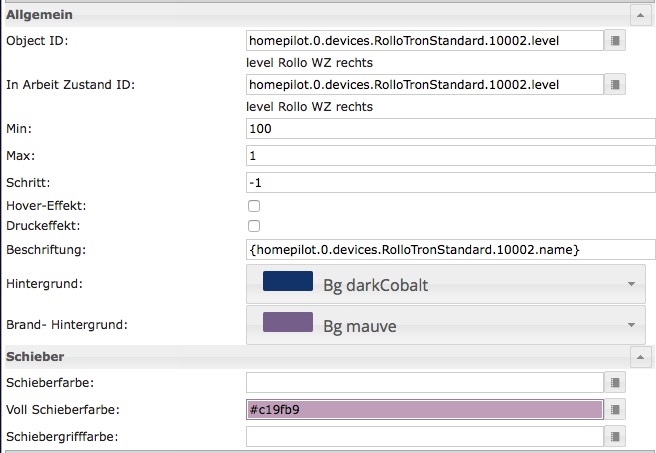

# ioBroker.homepilot

## Description
This adapter connects ioBroker and Rademacher's Homepilot Station 9496 (1/2) via TCP/IP to control Rademacher DuoFern radio controlled devices. Besides DuoFern broadcasts at 434,5 MHz. Homepilot syncs every 12s to ioBroker by default. On the other hand iobroker broadcasts its commands just in time. Therefore this adapter should be used to control homepilot actuators from ioBroker rather than read homepilot sensors to ioBroker.

### Supported devices

| Code | Product Name                | Note                                   |  Datapoint   | Product #              |
|:----:|:---------------------------:|:--------------------------------------:|:------------:|:----------------------:|
| 40   | RolloTron Standard          | Gurtwickler / shutter belt winder      |  level       |                        |
| 41   | RolloTron Comfort           | Gurtwickler / shutter belt winder      |  level       |                        |
| 42   | Rohrmotor-Aktor             |                                        |  level       | [9471-1](https://www.rademacher.de/fileadmin/rad-daten/pdf/2_VBD_621-1-_09.14_-D_DuoFern_Rohrmotor-Aktor_Druckfreigabe.pdf)                 |
| 43   | Schaltaktor 2-Kanal         |  Universalaktor                        |  state       | 9470-2                 |
| 46   | Schaltaktor 1-Kanal         |  Steckdosenaktor                       |  state       | 9470-1                 |
| 47   | Rohrmotor-Steuerung         |  Rohrmotor Steuerung                   |  level       |                        |
| 48   | Dimmer                      |  Dimmaktor                             |  level       |                        |
| 49   | Rohrmotor                   |                                        |  level       |                        |
|  4   | Z-WAVE                      | Heizkörperstellantrieb                 |  temperature |                        |

The actuator duofern code 43 supports a light mode and a device mode. Each mode delivers either ON (device mode) or OFF (light mode) when UP is pressed. Press DOWN is vice versa.

#### Not yet supported (Thx to [mhop](https://github.com/mhop/fhem-mirror/blob/master/fhem/FHEM/30_DUOFERN.pm))
| Code | Product Name                | Note                                   |  Datapoint   | Product #              |
|:----:|:---------------------------:|:--------------------------------------:|:------------:|:----------------------:|
| 4B   | Connect-Aktor               |                                        |              |                        |
| 4C   | Troll Basis                 |                                        |              |                        |
| 4E   | SX5                         |                                        |              |                        |
| 61   | RolloTron Comfort Master    |                                        |              |                        |
| 62   | SupeFake Device             |                                        |              |                        |
| 65   | Bewegungsmelder             |                                        |              |                        |
| 69   | Umweltsensor                |                                        |              |                        |
| 70   | Troll Comfort DuoFern       |                                        |              |                        |
| 71   | Troll Comfort DuoFern<br/>(Lichtmodus)|                                        |              |                        |      | (Lichtmodus)                |                                        |              |                        |
| 73   | Raumthermostat              |                                        |              |                        |
| 74   | Wandtaster 6fach 230V       |                                        |              |                        |
| A0   | Handsender<br/>(6 Gruppen-48 Geraete)|                                        |              |                        |      | (6 Gruppen-48 Geraete)      |                                        |              |                        |
| A1   | Handsender<br/>(1 Gruppe-48 Geraete) |                                        |              |                        |      | (1 Gruppe-48 Geraete)       |                                        |              |                        |
| A2   | Handsender<br/>(6 Gruppen-1 Geraet) |                                        |              |                        |      | (6 Gruppen-1 Geraet)        |                                        |              |                        |
| A3   | Handsender<br/>(1 Gruppe-1 Geraet) |                                        |              |                        |      | (1 Gruppe-1 Geraet)         |                                        |              |                        |
| A4   | Wandtaster                  |                                        |              |                        |
| A5   | Sonnensensor                |                                        |              |                        |
| A7   | Funksender UP               |                                        |              |                        |
| A8   | HomeTimer                   |                                        |              |                        |
| AA   | Markisenwaechter            |                                        |              |                        |
| AB   | Rauchmelder                 |                                        |              |                        |
| AD   | Wandtaster 6fach Bat        |                                        |              |                        |


## Configuration
### IP / Port
IP adress of Homepilot station within local network. If nothings is entered, the adapter will use __homepilot.local__. The port number is optional and only will be considered if an ip adress was set before.

### Synchronisation
In snyctime you can choose the frequency of connections to Homepilots base station in seconds. Default is 12s, input is optional.

##  Datapoints
There are to main channels, one for the station and one for all found devices (shutter belt winders, etc.):


homepilot.0.__station__ (data on Homepilot station)

homepilot.0.__devices.product__ (devices sort by product type)

Within *devices.product* each found device creates a new channel *devicedID*, e.g. homepilot.0.devices.rollotron.__10001__.balcony

homepilot.0.devices.product.*deviceID*.__name__ (string)

homepilot.0.devices.product.*deviceID*.__description__ (string)

homepilot.0.devices.product.*deviceID*.__productName__ (string)

homepilot.0.devices.product.*deviceID*.__duofernCode__ (string)

homepilot.0.devices.product.*deviceID*.__hasErrors__ (number)

homepilot.0.devices.product.*deviceID*.__status_changed__ (number, timecode)

homepilot.0.devices.product.*deviceID*.__cid__ (string, writeable) !!! WRITE STRING ONLY

homepilot.0.devices.product.*deviceID*.__level__ (number)

homepilot.0.devices.product.*deviceID*.__level_inverted__ (number)

homepilot.0.devices.product.*deviceID*.__temperature__ (number, alternatively)

homepilot.0.devices.product.*deviceID*.__state__ (boolean, only if product is switch)

homepilot.0.devices.__json__  (*JSON* file *json* Datapoint filled with returned JSON )

homepilot.0.station.__ip__ (string)

homepilot.0.station.__UNREACH__ (boolean) (true if Homepilot station is not reachable)


Datapoints *cid*, *level* and in some cases *state* are writeable and subscribed for changes stated from other adapters (e.g. VIS, Javascript, Scenes).

### Control
#### level and level_inverted
The shutters can be control from Javascript. VIS Widgets or Scenes in two ways.
For instance you can control the shutter with the DeviceID 10002 ('Living room right') by setting homepilot.0.devices.product.*10002*.__level__ to "30".
This datapoint only accepts integer numbers between 0 and 100. In addition to that you can use Homepilots command ID. Simply state one of the strings mentioned in the following table to homepilot.0.devices.product.*deviceID*.__cid__
If you prefer an "Homematic" like appearance (0% is dark/down, 100% is light/up) choose the datapoint __level_inverted__.

#### Command ID
Furthermore the datapoint *state* can be use to control switches. It is only created if the products name is "Universal-Aktor"/"Steckdosenaktor" or its serial number is 43 or 46. Simply use a VIS ctrl state widget to write *true*/*false*. This boolean value will be translated to a level 100 if *true* ord level 0 if *false*.
You can use these commands to control Homepilot with cid in homepilot.0.devices.product.*deviceID*.__cid__

| CID | Commands               |
| :--:|:---------------------------------|
| 1   | UP, up, HOCH, hoch, RAUF, rauf   |
| 2   | STOP, stop, Stop                 |
| 3   | DOWN, down, RUNTER, runter       |
| 4   | POSITION_0, position_0, 0%       |
| 5   | POSITION_25, position_25, 25%    |
| 6   | POSITION_50, position_50, 50%    |
| 7   | POSITION_75, position_75, 75%    |
| 8   | POSITION_100, position_100, 100% |
| 9   | *POSITION_N (not yet)*           |
| 10  | EIN, ein, AN, an, ON, on         |
| 11  | AUS, aus, OFF, off               |
| 23  | INCREMENT, increment, +          |
| 24  | DECREMENT, decrement, -          |

## VIS Widgets
### Example for shutters
```
[{"tpl":"tplValueFloat","data":{"oid":"homepilot.0.devices.RolloTronStandard.10002.level","visibility-cond":"==","visibility-val":1,"is_comma":true,"is_tdp":"false","factor":"1","gestures-offsetX":0,"gestures-offsetY":0,"signals-cond-0":"==","signals-val-0":true,"signals-icon-0":"/vis/signals/lowbattery.png","signals-icon-size-0":0,"signals-blink-0":false,"signals-horz-0":0,"signals-vert-0":0,"signals-hide-edit-0":false,"signals-cond-1":"==","signals-val-1":true,"signals-icon-1":"/vis/signals/lowbattery.png","signals-icon-size-1":0,"signals-blink-1":false,"signals-horz-1":0,"signals-vert-1":0,"signals-hide-edit-1":false,"signals-cond-2":"==","signals-val-2":true,"signals-icon-2":"/vis/signals/lowbattery.png","signals-icon-size-2":0,"signals-blink-2":false,"signals-horz-2":0,"signals-vert-2":0,"signals-hide-edit-2":false,"digits":"0","html_append_singular":" %","html_append_plural":" %","name":"RolloTron Percent","label":"{homepilot.0.devices.RolloTronStandard.10002.name}"},"style":{"left":"519px","top":"555px","color":"lightblue","text-align":"right","z-index":"20"},"widgetSet":"basic"},{"tpl":"tplValueLastchange","data":{"oid":"homepilot.0.devices.RolloTronStandard.10002.status_changed","visibility-cond":"==","visibility-val":1,"gestures-offsetX":0,"gestures-offsetY":0,"signals-cond-0":"==","signals-val-0":true,"signals-icon-0":"/vis/signals/lowbattery.png","signals-icon-size-0":0,"signals-blink-0":false,"signals-horz-0":0,"signals-vert-0":0,"signals-hide-edit-0":false,"signals-cond-1":"==","signals-val-1":true,"signals-icon-1":"/vis/signals/lowbattery.png","signals-icon-size-1":0,"signals-blink-1":false,"signals-horz-1":0,"signals-vert-1":0,"signals-hide-edit-1":false,"signals-cond-2":"==","signals-val-2":true,"signals-icon-2":"/vis/signals/lowbattery.png","signals-icon-size-2":0,"signals-blink-2":false,"signals-horz-2":0,"signals-vert-2":0,"signals-hide-edit-2":false,"format_date":"DD.MM.YYYY hh:mm:ss"},"style":{"left":"432px","top":"582px","z-index":"20","color":"lightblue","width":"148px","height":"15px","font-size":"80%","text-align":"right"},"widgetSet":"basic"},{"tpl":"tplMetroTileShutter","data":{"oid":"homepilot.0.devices.RolloTronStandard.10002.level","visibility-cond":"==","visibility-val":1,"step":"-1","bg_class":"bg-darkCobalt","brand_bg_class":"bg-mauve","gestures-offsetX":0,"gestures-offsetY":0,"signals-cond-0":"==","signals-val-0":true,"signals-icon-0":"/vis/signals/lowbattery.png","signals-icon-size-0":0,"signals-blink-0":false,"signals-horz-0":0,"signals-vert-0":0,"signals-hide-edit-0":false,"signals-cond-1":"==","signals-val-1":true,"signals-icon-1":"/vis/signals/lowbattery.png","signals-icon-size-1":0,"signals-blink-1":false,"signals-horz-1":0,"signals-vert-1":0,"signals-hide-edit-1":false,"signals-cond-2":"==","signals-val-2":true,"signals-icon-2":"/vis/signals/lowbattery.png","signals-icon-size-2":0,"signals-blink-2":false,"signals-horz-2":0,"signals-vert-2":0,"signals-hide-edit-2":false,"min":"100","max":"1","oid-working":"homepilot.0.devices.RolloTronStandard.10002.level","name":"Rollotron Metro","label":"{homepilot.0.devices.RolloTronStandard.10002.name}","sliderColor":"","sliderMarkerColor":"","sliderCompleteColor":"#c19fb9"},"style":{"left":"301px","top":"439px","z-index":"15"},"widgetSet":"metro"}]
```

Bottom right corner shows the level datapoint as a number. Under the transparent metro widget a lastchange-widget is positionend. It shows any shutter movement.


