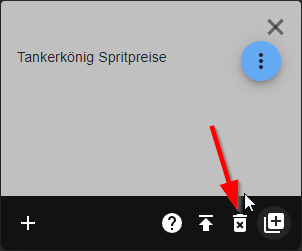

## Adapter Migration

## Update from 2.x.x to 3.3.x English
There are 2 variants:
1. uninstall adapter completely and reinstall (recommended) Procedure:
	1. you go to the Adapter UI and save your `API-Key` and if you want the `Stadium ID`.
	2. you go to the tab Adapter and uninstall the adapter (**Attention** all data points will be deleted)\
	   if you log data points (e.g. with InfluxDB) you have to enable them again afterwards\
	   
	3. you install the new adapter
	4. you enter your API key again
	5. you create the stations again\
	    
2. you make an update to the 3.x.x version Procedure:
	1. you go to the Adapter UI and save your `stations IDs` if you want to do it.
	2. you go to the Adapter tab and make an update to the 3.x.x version
	3. you go into the objects and search for `tankerkoenig.0.stations` and delete these objects **Attention** your loggers\
	   (e.g. InfluxDB etc.) will be deleted if you use\
	   them, they can be reactivated after creating the new datapoints on the\
	   new objects and the data will still be logged
	4. you go to the Adapter UI and create the new stations.
	5. you go to the Instances tab and start the adapter creates the objects again now you only have to reactivate\
	   the data points that were logged before.

## Update von 2.x.x auf 3.3.x Deutsch
Es gibt 2 Varianten:
1. Deinstalliere den Adapter komplett und installiere ihn neu (empfohlen) Vorgehensweise:
	1. du gehst zur Adapter UI und speicherst deinen `API-Key` und wenn du willst die `Stadium ID`.
	2. du gehst auf den Reiter Adapter und deinstallierst den Adapter (**Achtung** alle Datenpunkte werden gelöscht)\
	   wenn du Datenpunkte protokollierst (z.B. mit InfluxDB), musst du sie anschließend wieder aktivieren\
	   
	3. du installierst den neuen Adapter
	4. Du gibst deinen API-Schlüssel erneut ein
	5. Du erstellst die Stationen erneut.\
	    
2. Du machst ein Update auf die Version 3.x.x Vorgehensweise:
	1. du gehst zur Adapter UI und speicherst deine `Stations IDs`, wenn du das möchtest.
	2. Du gehst auf die Registerkarte "Adapter" und machst ein Update auf die Version 3.x.x.
	3. du gehst in die Objekte und suchst nach `tankerkoenig.0.stations` und löschst diese Objekte **Achtung** deine Logger\
	   (z.B. InfluxDB etc.) werden auch gelöscht, wenn du sie benutzt, sie können nach dem Erstellen der neuen Datenpunkte auf den\
	   neuen Objekten wieder aktiviert werden und die Daten werden weiterhin geloggt
	4. Du gehst zum Adapter UI und erstellst die neuen Stationen.
	5. Du gehst zur Registerkarte Instanzen und startest den Adapter. Der Adapter erstellt die Objekte erneut, \
	   jetzt musst du nur noch die Datenpunkte neu aktivieren, die vorher geloggt wurden.
