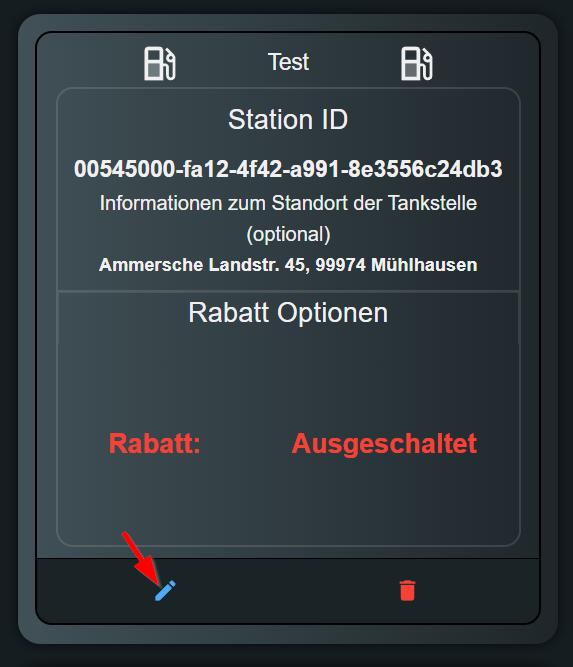
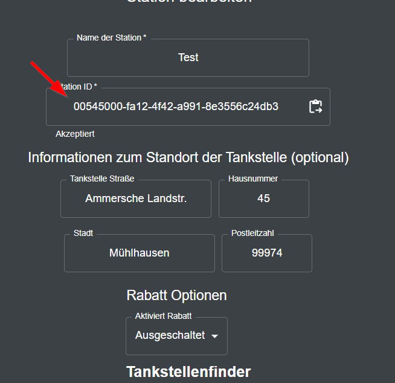
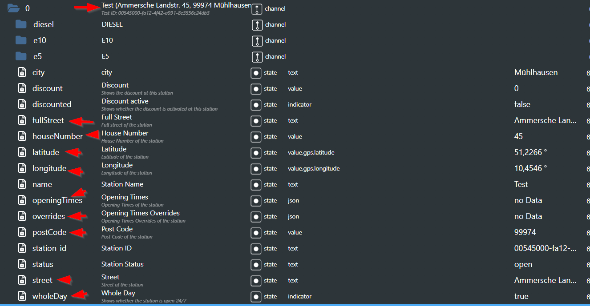

## Adapter Migration

## Update from 3.1.x to 3.3.x or 3.2.x to 3.3.x deutsch :de:
Nach dem Update müssen sie in die UI gehen und die Stationen bearbeiten (**alle stationen**).\
Das ist notwendig, da in der Konfiguration einige neue Felder hinzugefügt wurden, die ich so nicht automatische anlegen kann, da ich sonst in die User Konfiguration eingreife.\
Deswegen müssen die Stationen bearbeitet werden und die Felder, die ich hinzugefügt habe, mit den richtigen Werten befüllen, da es sonst zu Fehlern kommet.\
\
Hier müsst ihr die Stations ID einmal rauskopieren und wider einfügen, damit die abgefragten Daten (Adresse usw.) in die Konfiguration hinzugefügt werden.\
\
Danach müsst ihr nur noch auf Hinzufügen und Speichern klicken, nach einem Adapter Neustart sollte alle neuen Datenpunkte und der Name von der Station angepasst werden.

## Update from 3.1.x to 3.3.x or 3.2.x to 3.3.x english :gb:
After the update, you have to go into the UI and edit the stations (**all stations**).\
This is necessary because in the configuration some new fields have been added, which I cannot automatically create because I otherwise interfere with the user configuration.\
Therefore, the stations must be edited and the fields that I have added must be filled with the correct values, and otherwise errors will occur.\
\
Here you have to copy the station ID once and paste it back in, so that the queried data (address, etc.) are added to the configuration.\
\
After that, you just have to click on Add and Save, after an adapter restart all new data points and the name of the station should be adjusted.

